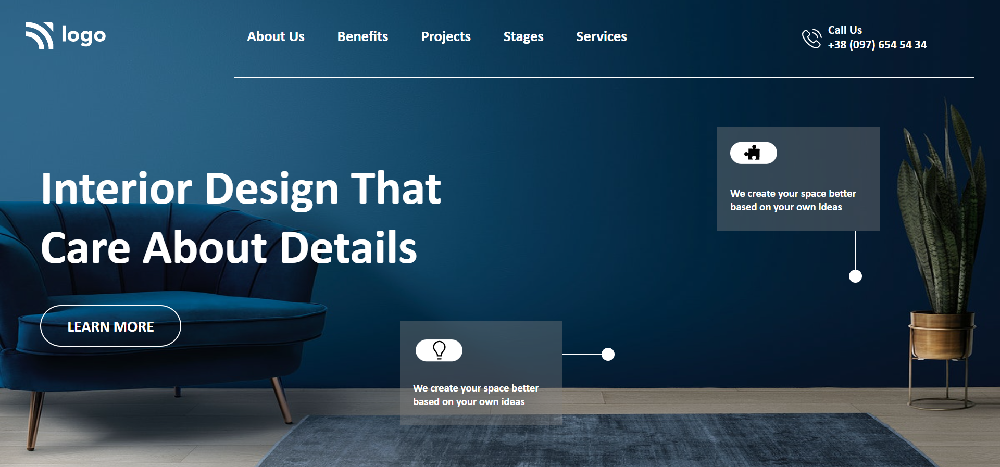

# Mohan Chindam

- I learned how to SVG images on the web page.
- Used properties like flexbox, position, and background positioning.
- Refined my skills like positioning, margin, and sizing of elements.
- Tried different ways to manipulate the size and positioning of elements.
- It took nearly five hours to complete this project.
- One web page took most of the time to size the SVG images.

- Below image shows the preview of the project:

I deployed the project on **Netlify**:
- You can preview the project here, [**Interior Design landing page**]()

